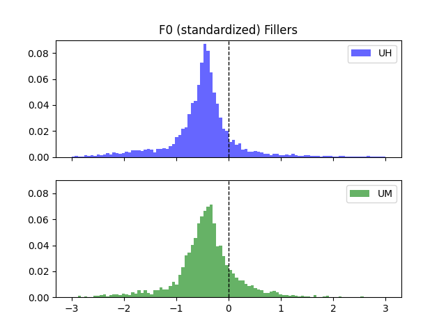
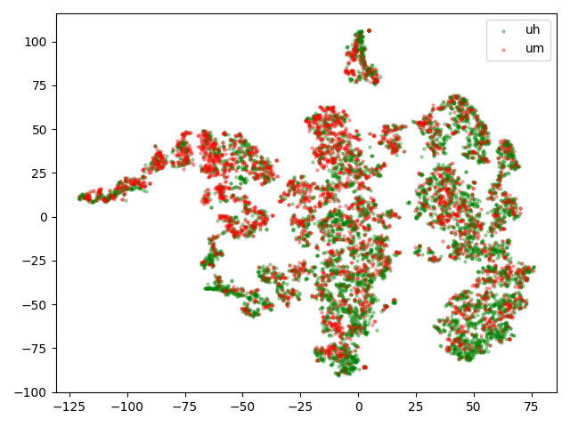
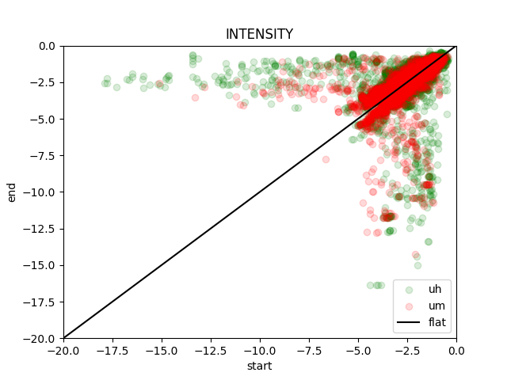
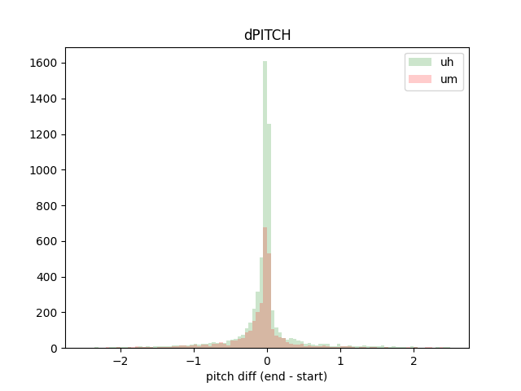
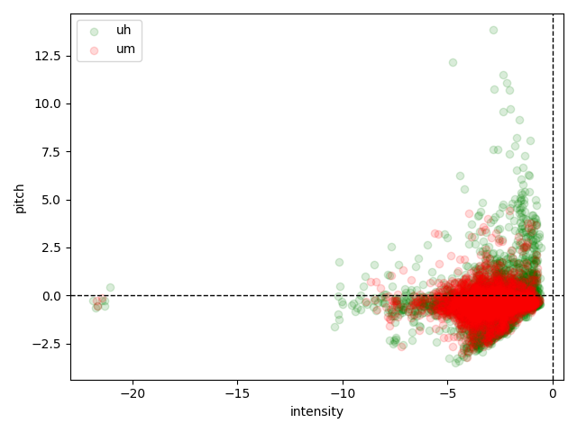
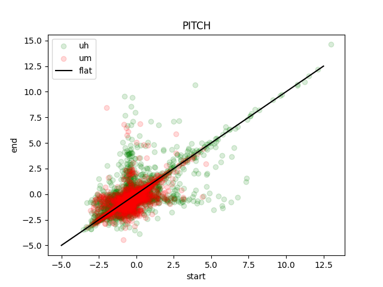

* Find fillers "that make a difference"
* Find fillers "that are unnecessary"
* Then
    * Visualize VAD
        - Are there any obvious differences in the turn-taking *context* around the filler?
        - Single speaker?
        - back and forth (backchannels, end of utterance, etc)
    * Define context
        - inside a long utterance?
        - close to other speaker (is it a backchannel?)

### Fillers are low in pitch

### Fillers are 'equally' short ("um" is slightly longer and varied)

### No-filler result in faster turn-shift (green)

### Prosody (pitch, intensity, duration) TSNE

    
    
    
    
    

